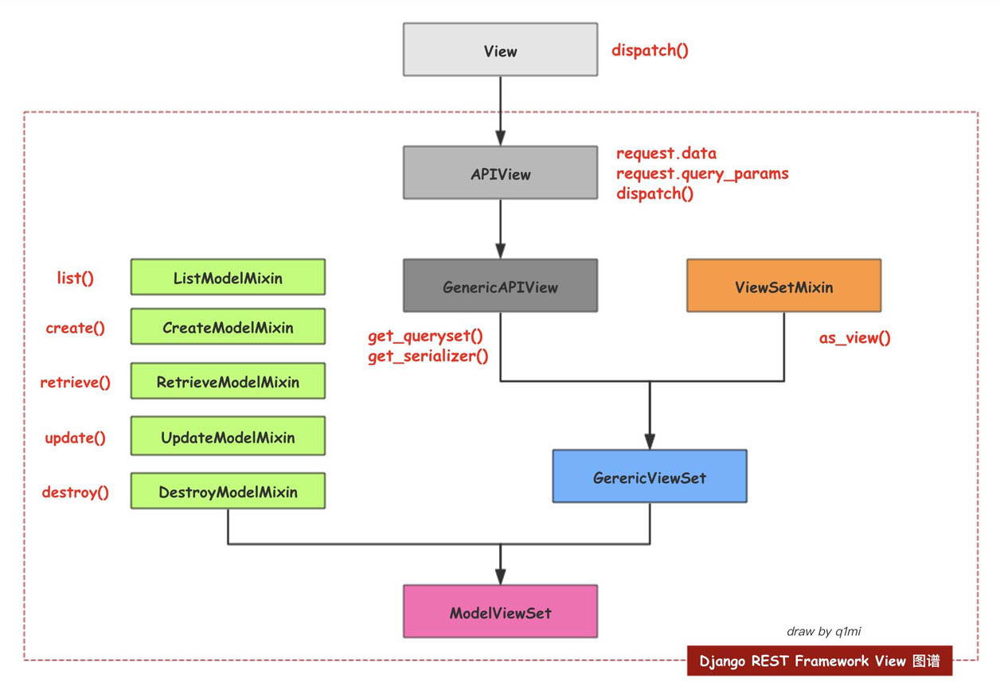

# DevOps9

## 基础环境
- Python 3.6.8
- Django 2.2
- MySQL 5.6
- CentOS 6.8+

## 序列化和反序列化
- 翻译
- 验证
- 数据库操作
```bash
序列化      // database -> django -> 用户
反序列化    // 用户 -> django -> database
```

## FBV / CBV / DRF
```bash
FBV: function base view
CBV: class base view
DRF: Django rest framework
```

## DRF解决问题
```bash
1. 序列化和反序列化
- 将数据库中的数据翻译成json
- 将用户的输入的内容，转化成dict/list
2. view视图如何响应用户的请求
- 用户输入url+method(GET/POST/PUT/DELETE)+DATA
如何找到对应的view
```

## DRF分类

- 视图类（view(Django)/APIView/GenericAPIView  
负责处理request/response/分页/搜索/过滤等
- 视图工具类(mixins)  
负责处理具体的操作即增删改查等
- 视图集  
ViewSet/GenericViewSet

视图集 = 视图类 + 视图工具类

## 问题汇总
- 库兼容问题
```bash
如果在同步时报错，如下
django.core.exceptions.ImproperlyConfigured: mysqlclient 1.3.13 or newer is required; you have 0.9.2

## 解决办法
/Users/zhengyansheng/.local/share/virtualenvs/devops9-WCesYJ9E/lib/python3.6/site-packages/django/db/backends/mysql/base.py
/Users/zhengyansheng/.local/share/virtualenvs/devops9-WCesYJ9E/lib/python3.6/site-packages/django/db/backends/mysql/operations.py

```

## 用户权限系统（m2m）
- 用户
- 角色
- 权限（单独表）

## 过滤器
- [django-filter](https://django-filter.readthedocs.io/en/master/index.html)


## Vue
- 双向绑定
- 组件化

## 扩展auth_user表时报错
```bash
$ pipenv run python manage.py makemigrations
django.db.migrations.exceptions.InconsistentMigrationHistory: Migration admin.0001_initial is applied before its dependency users.0001_initial on database 'default'.


## 解决办法
$ pipenv run python manage.py showmigrations
admin
 [X] 0001_initial
 [X] 0002_logentry_remove_auto_add
 [X] 0003_logentry_add_action_flag_choices
auth
 [X] 0001_initial
 [X] 0002_alter_permission_name_max_length
 [X] 0003_alter_user_email_max_length
 [X] 0004_alter_user_username_opts
 [X] 0005_alter_user_last_login_null
 [X] 0006_require_contenttypes_0002
 [X] 0007_alter_validators_add_error_messages
 [X] 0008_alter_user_username_max_length
 [X] 0009_alter_user_last_name_max_length
 [X] 0010_alter_group_name_max_length
 [X] 0011_update_proxy_permissions
contenttypes
 [X] 0001_initial
 [X] 0002_remove_content_type_name
sessions
 [X] 0001_initial
users
 [ ] 0001_initial // 冲突报错
$ rm -r users/migrations
$ pipenv run python manage.py migrate --fake admin zero
$ pipenv run python manage.py migrate --fake auth zero
$ pipenv run python manage.py migrate --fake contenttypes zero
$ pipenv run python manage.py migrate --fake sessions zero

// 进入数据库全部清除

```